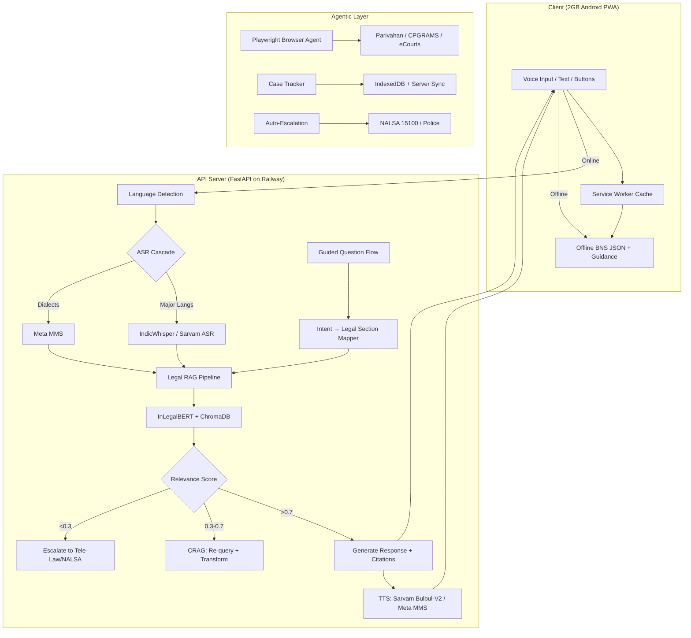

# Chakravyuha — Deep Market & Technical Research Report


---

## 1. Executive Summary

Chakravyuha targets the intersection of three massive gaps in India: **legal illiteracy** (80%+ of 1.4B population), **language exclusion** (legal system operates in English while hundreds of millions speak only regional dialects), and **access poverty** (only 15 judges per million, 52.5M pending cases). The market opportunity is real — India's legal AI market was USD 29.5M in 2024 growing at 23% CAGR to USD 106.3M by 2030, within a broader legal tech market of USD 1.25B by 2030.

**However, no existing product comes close to solving the full Chakravyuha problem statement.** The closest is OpenNyAI's Jugalbandi — but it lacks dialect-level ASR, agentic form-filling, auto-escalation, and offline mode. Several hackathon-grade GitHub repos exist for IPC RAG chatbots, but none achieve the accuracy, dialect coverage, or agentic capabilities required.

**Decision**: This is a greenfield opportunity with strong social impact. The hackathon team should build on existing open-source components (Jugalbandi architecture, AI4Bharat/Sarvam models, OpenNyAI legal NLP) rather than starting from scratch.

---

## 2. Market Size & Opportunity

| Metric | Value | Source |
|--------|-------|--------|
| India Legal AI Market (2024) | USD 29.5M | Grand View Research |
| India Legal AI Market (2030 est.) | USD 106.3M (23% CAGR) | Grand View Research |
| India Legal Tech Market (2023) | USD 464.6M | Grand View Research |
| India Legal Tech Market (2030 est.) | USD 1,253.1M (15.2% CAGR) | Grand View Research |
| AI-Powered LegalTech + Compliance (2024) | USD 1.5B | Ken Research |
| Global Legal AI Market (2024) | ~USD 1.7B | Emergen Research |

### Bottom-Up TAM/SAM/SOM Estimate

- **TAM**: ~800M Indians eligible for free legal aid × potential SaaS/gov-funded model = massive addressable population
- **SAM**: ~200M smartphone users in underserved communities who lack legal access
- **SOM** (realistic year 1): 1-5M users via government partnerships (Tele-Law integration, CSC network)

---

## 3. Access to Justice Gap — The Problem is Enormous

| Statistic | Number | Source |
|-----------|--------|--------|
| Pending court cases (2025 est.) | **52.5 million** (~525 lakh) | India Data Map |
| Subordinate court backlog | ~450 lakh cases | India Data Map |
| High Court backlog | ~62 lakh cases | India Data Map |
| Judge-to-population ratio | **21 per million** (recommended: 50) | India Justice Report 2025 |
| Legal aid availed (2023-24) | Only 15.5 lakh despite **80% eligibility** | Insights on India |
| Rural legal aid access | Only **15%** | PRS Legislative Research |
| Legal aid budget share | **<1%** of total justice budget | India Justice Report 2025 |
| NALSA spending per capita | Rs 2-16 across states | NALSA Statistics |
| Tele-Law beneficiaries | **2.1 crore** (21M) by Feb 2025 | Tele-Law Portal |
| Worst backlog: Uttar Pradesh | 117 lakh cases alone | India Data Map |

**Key insight**: 80% of India's population is *eligible* for free legal aid, but only 15.5 lakh actually received it. The gap is not just legal — it's linguistic and technological.

---

## 4. Government Initiatives & Tailwinds

- **Tele-Law Scheme**: Reached 2.1 crore beneficiaries via Common Service Centres (CSCs), 39% women, 31% OBC/SC. Pre-litigation advice via video/phone. *This is the natural distribution partner for Chakravyuha.*
- **eCourts Project**: Phase III underway for computerizing all courts; Supreme Court AI case management processed **4.7M cases annually** in 2024
- **Legal Services Authorities Act (2024 amendment)**: Explicitly recognizes AI tools as acceptable aids in legal practice
- **DPDP Act 2023 + Rules 2025**: Full enforcement from 13 May 2027; requires consent, data minimization, purpose limitation — directly impacts Chakravyuha's privacy architecture
- **No AI-specific legislation yet**: MeitY's AI Governance Guidelines are advisory, not law. Feb 2026 IT Rules amendments target synthetic content but not legal AI specifically
- **Bar Council**: No explicit prohibition on AI giving legal *information* (vs. legal *advice*) — a critical distinction for Chakravyuha

---

## 5. Competitive Landscape

### 5.1 Direct Competitors (India)

| Product | What It Does | Voice? | Dialects? | Agentic? | Offline? | Gaps vs Chakravyuha |
|---------|-------------|--------|-----------|----------|----------|---------------------|
| **Jugalbandi** (OpenNyAI) | WhatsApp chatbot for gov schemes + legal info; text + voice; Bhashini models | Yes (via Bhashini) | Standard languages only, no dialect ASR | No form-filling | No | No dialect ASR, no agentic actions, no case tracking, no auto-escalation |
| **Haqdarshak** | Rights awareness + scheme enrollment; field worker model | No | No | Manual enrollment assist | No | Not AI-first, no legal advice, no voice |
| **Vakilsearch / Zolvit** ($12M raised) | Incorporation, trademark, GST, compliance for SMEs | No | English/Hindi | No | No | Enterprise focus, not citizen legal aid |
| **Lawrato** | Lawyer marketplace; search by practice area, language | No | No | No | No | Marketplace, not AI assistant |
| **Legistify** | Enterprise legal ops, contract management, litigation tracking | No | No | No | No | Enterprise B2B, not citizen-facing |
| **JIVA** (OpenNyAI) | Judge's assistant for law search | No | No | No | No | For judges, not citizens |

### 5.2 International Comparators

| Product | What It Does | India Relevance |
|---------|-------------|-----------------|
| **Harvey AI** ($8B valuation, $160M Series F Dec 2025) | LLM for law firms; research + drafting | Enterprise-only, English, no voice, no Indian law |
| **DoNotPay** | Consumer chatbot for tickets/refunds | US-only; hit with class action lawsuit for unauthorized practice of law |
| **CoCounsel** (Thomson Reuters) | Legal research AI | Enterprise English-only |
| **Spellbook** | Contract drafting AI | English, no Indian law |

### 5.3 Positioning Gaps — What NO Existing Product Does

| Chakravyuha Feature | Closest Existing | Gap |
|---------------------|-----------------|-----|
| Dialect-level ASR (Bhojpuri, Tulu, Chhattisgarhi) | Jugalbandi (standard langs only) | **No product handles dialectal variation** |
| Agentic form-filling on gov portals | None | **Completely unaddressed** |
| Auto-escalation to police/NALSA | None | **No automated emergency routing** |
| Offline legal briefing | None | **All require internet** |
| End-to-end case tracking | Legistify (enterprise only) | **No citizen-facing tracker exists** |
| Defence strategy generation | LawGPT (basic IPC RAG) | **No product surfaces defence strategies proactively** |

---

## 6. Existing GitHub Repos Analysis

**None solve the full Chakravyuha problem.** Here's what exists:

| Repo | What It Does | What's Missing |
|------|-------------|----------------|
| **OpenNyAI/Jugalbandi-Manager** | Full conversational chatbot platform; WhatsApp/web; voice via Bhashini; multi-language | No dialect ASR, no agentic actions, no IPC/BNS RAG, no form-filling, no escalation |
| **OpenNyAI/Opennyai** | NER on Indian legal texts, judgment structuring, rhetorical roles | NLP pipeline only, not a chatbot or voice assistant |
| **Kopika0208/AskLegal.ai** | RAG over IPC with inLegalBERT + FAISS + Gemini; chatbot + judgment prediction | English only, no voice, no multilingual, no dialect, no agentic, no BNS |
| **harshitv804/LawGPT** | RAG over IPC with Streamlit + LangChain + TogetherAI | English only, IPC only (not BNS), no voice, no dialect, no agentic |
| **Yashism/IPC-Laws-Assistant** | AI chatbot for crime case analysis + IPC section identification; multilingual | No voice, no dialect ASR, no agentic, no form-filling, basic accuracy |
| **lawglance/lawglance** | RAG-based legal assistant with voice commands + multilingual | Early stage, no dialect support, no agentic actions |
| **Anish-2005/LawAI-PrivacyV** | Law enforcement focused; speech-to-text; multi-language (SIH 2024) | For police not citizens, ML-only (no LLM), no agentic |
| **Sreyan88/Multilingual-Indic-ASR** | Multilingual Indic ASR research | ASR only, no legal domain |
| **AI4Bharat/vistaar** | Indian language ASR benchmarks + IndicWhisper | Benchmark/model, not an application |
| **law-ai/InLegalBERT** (HuggingFace) | BERT fine-tuned on Indian legal corpus | Embedding model only, not a chatbot |

**Bottom line**: The best existing pieces are Jugalbandi (platform architecture), OpenNyAI (legal NLP), and individual hackathon IPC RAG bots — but none achieve >85% legal section accuracy on dialect voice input with agentic capabilities.

---

## 7. Technical Feasibility Assessment

### 7.1 Speech (ASR) — Available Models

| Model/Platform | Languages | Dialects? | Open Source? | Cost | Notes |
|---------------|-----------|-----------|-------------|------|-------|
| **AI4Bharat IndicWhisper** | 12 Indian langs, 10,700+ hrs training | Standard only | Yes (MIT) | Free | Lowest WER on 39/59 Vistaar benchmarks; fine-tuned Whisper |
| **AI4Bharat IndicConformer** (600M) | 12+ Indian langs | Limited dialect | Yes | Free | Latest model; NeMo-based Conformer |
| **Sarvam AI ASR** | 22 Indian langs | Regional accents | API (freemium) | Free tier | Streaming ASR, code-mixed support |
| **Meta MMS** | 1,107 languages | **Yes**: Bhojpuri (bho), Chhattisgarhi (hne), Tulu (tcy), Awadhi (awa) | Yes (CC-BY-NC) | Free | Only option for target dialects; WER 30-45% on dialects |
| **OpenAI Whisper large-v3** | Hindi, Tamil, Bengali, etc. | Poor on dialects | Yes (MIT) | Free | Good for standard langs, degrades on Bhojpuri/Tulu |
| **Google Speech-to-Text** | 30+ Indian locales | Bhojpuri (bho-IN) only | No (API) | $0.006/15s, 60min free | Best quality but paid |
| **Vakyansh (EkStep)** | Multiple Indian | Limited | Yes | Free | Older models, CLSRIL-23 pretrained |

### 7.2 Dialect WER Reality

| Dialect | Best Available ASR | Estimated WER | Notes |
|---------|-------------------|---------------|-------|
| Standard Hindi | IndicWhisper | <10% | Well-resourced |
| **Bhojpuri** | Meta MMS | **30-40%** | Only realistic option; Google STT also has bho-IN |
| **Chhattisgarhi** | Meta MMS | **35-45%** | Very limited training data; RESPIN has 250hrs dataset |
| **Tulu** | Meta MMS | **35-45%** | Dravidian, very low resource |
| **Awadhi** | Meta MMS | **35-45%** | Often confused with Hindi |
| **Madurai Tamil** | IndicWhisper (as Tamil) | **20-30%** | Dialectal variation; no dialect-specific model |

**Target**: <20% WER on 3+ dialects — achievable for Hindi dialects with confirmation UI, very hard for Tulu.

**Recommended Cascade Strategy**:
1. Primary: **IndicWhisper** for 12 major languages (best WER)
2. Fallback: **Meta MMS** for dialects (Bhojpuri, Chhattisgarhi, Tulu, Awadhi)
3. Optional: **Google STT** as cloud backup for demo

### 7.3 Text-to-Speech (TTS)

| Model | Languages | Dialects? | Quality | Open Source? |
|-------|-----------|-----------|---------|-------------|
| **AI4Bharat IndicTTS** | 13 Indian langs | No | Good (MOS 3.5-4.0) | Yes (MIT) |
| **Sarvam Bulbul-V2** | 11 Indian langs | "Authentic regional accents" | Best available | API (freemium) |
| **Google Cloud TTS** | 10+ Indian langs | No | High (WaveNet) | No ($4-16/1M chars) |
| **Meta MMS TTS** | 1,107 langs inc. Bhojpuri, Tulu, etc. | **Yes** | Basic/robotic (MOS 2.5-3.5) | Yes (CC-BY-NC) |
| **Piper TTS** | Hindi available | No | Decent, fast | Yes (MIT) |
| **eSpeak-ng** | Many Indian langs | Some | Robotic | Yes | Tiny (~2MB), good for offline |

**Recommendation**: Sarvam Bulbul-V2 for major langs, Meta MMS TTS for dialects, Piper for offline fallback.

### 7.4 LLM Options (No Paid Commercial APIs)

| Model | Params | Indian Langs | Open Source | Notes |
|-------|--------|-------------|-------------|-------|
| **Sarvam-1** | 2B | 10 Indic langs | Yes | Small, can run on modest hardware |
| **Sarvam-M** | 24B | Indian + English | Yes (weights) | Best balance of capability + Indian lang support |
| **Sarvam-105B** | 105B | 22 Indian langs, 128K context | Yes (weights) | Top capability but needs GPU server |
| **Airavata** (AI4Bharat) | 7B | Hindi + tasks | Yes | Best open-source Hindi instruction-following |
| **OpenHathi** (Sarvam) | 7B | Hindi, Hinglish | Yes | Good Hindi vocabulary |
| **Llama 3.1 8B** | 8B | Limited Indic | Yes | Good reasoning, limited Indic |
| **Gemma 2 9B** | 9B | Some Indic | Yes | Decent Hindi |

**2GB RAM Android constraint**: No LLM runs locally on 2GB RAM. Solution: PWA frontend → server-side inference on free-tier hosting.

### 7.5 Legal RAG Architecture

#### Corpus Sources

| Resource | Coverage | Access |
|----------|----------|--------|
| **Indian Kanoon** | All courts, all acts, SC/HC judgments | Web scraping (no official API) |
| **indiacode.nic.in** | BNS 2023, BNSS 2023, BSA 2023, all Central/State Acts | Public, needs scraping |
| **ILDC Benchmark** | 34K Supreme Court judgments with decisions | Open dataset (GitHub) |
| **OpenNyAI Legal NER** | 9,435 judgment sentences + 1,560 preambles | Open source |
| **InLegalBERT** | BERT fine-tuned on Indian legal text | HuggingFace |
| **IL-TUR** | Multi-task Indian legal NLP benchmark | Research |

#### Chunking Strategy

```
Document Structure:
├── Act (e.g., BNS 2023)
│   ├── Chapter (e.g., Chapter VI - Of Offences Against the State)
│   │   ├── Section (e.g., Section 152 - Waging war against India)
│   │   │   ├── Sub-section
│   │   │   ├── Explanation
│   │   │   └── Illustrations
```

Section-level chunking with metadata:
```json
{
  "section_id": "BNS-103",
  "act": "Bharatiya Nyaya Sanhita, 2023",
  "replaces": "IPC-302",
  "effective_date": "2024-07-01",
  "jurisdiction": "Central",
  "chapter": "VI - Of Offences Affecting the Human Body",
  "punishment": "Death or imprisonment for life, and fine",
  "cognizable": true,
  "bailable": false,
  "court": "Court of Session"
}
```

#### RAG Stack

- **Embeddings**: InLegalBERT or BGE-base fine-tuned
- **Vector DB**: ChromaDB (simplest for hackathon) or FAISS
- **Retriever**: Hybrid BM25 + Dense embeddings
- **Reranker**: cross-encoder/ms-marco-MiniLM-L-6-v2
- **IPC→BNS mapping table**: Cross-reference old sections to new

### 7.6 Agentic Browser Automation

**Playwright** (recommended over Puppeteer):
- Python support (aligns with ML stack)
- Better auto-waiting for slow gov portals
- Multi-browser support
- Better iframe handling

**Government Portal Challenges**:
- **eCourts**: CAPTCHA on search, no API, server-rendered
- **CPGRAMS**: OTP-based auth, complex multi-step forms
- **Parivahan**: Heavy CAPTCHA, aggressive session timeouts (5-10 min)

**CAPTCHA Handling**:
1. User-assisted (most ethical): show to user, forward response
2. Audio CAPTCHA + Whisper ASR (accessibility-compliant)
3. Simple OCR with pytesseract for basic text CAPTCHAs (70-90% success)

**OTP-Pause Pattern**:
```python
# Pseudocode
async def gov_portal_flow(page, user_context):
    await page.goto("https://portal.gov.in/")
    await page.fill("#field", user_context.data)
    await page.click("#send_otp")

    # PAUSE — notify user via WebSocket
    otp = await wait_for_user_input(
        prompt="Enter OTP sent to your phone",
        timeout=300,
        channel=user_context.websocket
    )

    await page.fill("#otp_field", otp)
    await page.click("#verify")
    result = await page.query_selector(".result")
    return await result.inner_text()
```

### 7.7 Deployment Architecture

```
┌─────────────────────────────────┐
│   2GB Android Device (PWA)      │
├─────────────────────────────────┤
│ - Lightweight UI (Preact <5MB)  │
│ - Audio recording (MediaRecorder)│
│ - Cached legal briefings (IDB)  │
│ - Offline first-aid legal info  │
│ - Service Worker                │
└──────────┬──────────────────────┘
           │ HTTPS / WebSocket
┌──────────▼──────────────────────┐
│   Server (HF Spaces / Modal)    │
├─────────────────────────────────┤
│ - ASR (IndicWhisper / MMS)      │
│ - LLM (Sarvam-M / Airavata)    │
│ - TTS (Bulbul-V2 / MMS)        │
│ - Legal RAG (ChromaDB + FAISS)  │
│ - Playwright automation         │
└─────────────────────────────────┘
```

**Free Hosting Stack**:

| Component | Host | Cost |
|-----------|------|------|
| PWA frontend | Vercel / Netlify / GitHub Pages | Free |
| API server (FastAPI) | Railway ($5 free) or Render | Free |
| LLM inference | HuggingFace Spaces (ZeroGPU) | Free |
| ASR/TTS | Same HF Space or separate | Free |
| Vector DB | Embedded ChromaDB on API server | Free |
| Playwright | Railway or Render | Free |
| **Total** | | **$0** |

---

## 8. Risks & Caveats

| Risk | Severity | Mitigation |
|------|----------|-----------|
| **Legal hallucination** | CRITICAL | Strict RAG grounding; reject if retrieval score < threshold; cite exact sections; never generate legal claims from LLM alone |
| **Dialect ASR accuracy** | HIGH | Start with 2-3 best-supported dialects; set honest WER expectations; use text fallback + confirmation UI |
| **Unauthorized practice of law** | HIGH | Frame as "legal information" not "legal advice"; add disclaimers; route to human lawyers for actionable decisions |
| **DPDP Act compliance** | MEDIUM | Zero-retention by design; explicit consent flows; no data stored without user permission |
| **Bad actor misuse** | MEDIUM | Intent classification layer; refuse to generate offense strategies; detect aggressor language patterns |
| **Stale legal corpus** | MEDIUM | IPC→BNS transition (July 2024); must handle both with date-aware routing |
| **Gov portal automation brittleness** | MEDIUM | Portals change frequently; needs monitoring + graceful degradation |
| **"No paid APIs" constraint** | LOW-MED | Sarvam offers free tier; HuggingFace Spaces free T4; but scale is limited |
| **LLM hosting cold start** | MEDIUM | Free-tier GPU has 30-60s cold start; keep Space active or use smaller model |

---

## 9. Hackathon Build Recommendation — What to Build in 24 Hours

### Priority Stack

**1. MUST HAVE (Demo-critical):**
- Voice input in 2-3 languages (Hindi + Tamil + 1 dialect like Bhojpuri) via Sarvam ASR API or IndicWhisper
- Legal RAG over BNS/IPC sections with >85% accuracy on curated test scenarios
- Step-by-step guidance in plain language via Sarvam-M LLM
- TTS response in user's language via Sarvam Bulbul-V2
- Basic Streamlit/Gradio PWA frontend

**2. SHOULD HAVE (Differentiator):**
- Browser agent demo on Parivahan portal (Playwright)
- Defence strategy surfacing (Rule 139 example)
- Case tracker with session persistence

**3. NICE TO HAVE (If time permits):**
- Auto-escalation simulation (Twilio free tier → NALSA number)
- Offline cached legal briefings
- 3+ dialect WER report

### Recommended Tech Stack Summary

| Layer | Technology | Rationale |
|-------|-----------|-----------|
| **ASR (major languages)** | IndicWhisper / Sarvam ASR | Best WER, open source |
| **ASR (dialects)** | Meta MMS | Only option for Bhojpuri/Tulu/Chhattisgarhi |
| **TTS (major)** | Sarvam Bulbul-V2 / IndicTTS | Best quality, free tier |
| **TTS (dialects)** | Meta MMS TTS | Only option, basic quality |
| **LLM** | Sarvam-M (24B) or Airavata (7B) | Open source, free, good Indic |
| **Legal RAG** | ChromaDB + InLegalBERT + BM25 | Simple, effective, free |
| **Legal corpus** | BNS/BNSS from indiacode.nic.in + ILDC | Most current Indian law |
| **Browser automation** | Playwright (Python) | Best for gov portals |
| **Frontend** | PWA (Preact + Service Worker) | Works on 2GB Android |
| **Backend** | FastAPI (Python) | Unifies ML stack |
| **Hosting** | HF Spaces (GPU) + Vercel (frontend) + Railway (API) | All free tier |

### Agent Pipeline Architecture

```
Voice Input → Language/Dialect Detection
    → Sarvam ASR / Meta MMS (voice→text)
    → Intent Classification (Sarvam-M)
    → Legal RAG (InLegalBERT + FAISS over BNS/IPC)
    → Response Generation (Sarvam-M with grounded sections)
    → Defence Strategy Check (pattern-matched legal provisions)
    → Sarvam Bulbul-V2 / Meta MMS TTS (text→voice in dialect)
    → [If action needed] Playwright Agent for gov portal
    → [If urgent] Twilio for emergency escalation
    → Case Tracker (persist in DB, poll for updates)
```

---

## 10. Open-Source Building Blocks to Reuse

| Component | Repo/Link | Use For |
|-----------|-----------|---------|
| Jugalbandi-Manager | github.com/OpenNyAI/Jugalbandi-Manager | Chatbot platform architecture, WhatsApp integration |
| OpenNyAI NLP | github.com/OpenNyAI/Opennyai | Legal NER, judgment structuring |
| InLegalBERT | huggingface.co/law-ai/InLegalBERT | Legal text embeddings for RAG |
| AI4Bharat IndicWhisper | huggingface.co/ai4bharat | ASR for scheduled Indian languages |
| AI4Bharat IndicConformer | huggingface.co/ai4bharat/indic-conformer-600m-multilingual | Latest ASR model |
| Meta MMS | huggingface.co/facebook/mms-1b-all | Dialect ASR + TTS |
| Sarvam AI | sarvam.ai/models | ASR, TTS (Bulbul-V2), LLM (Sarvam-M) |
| RESPIN Chhattisgarhi | (via Springer) | Dialect ASR training data (250hrs) |
| ILDC Dataset | github.com/Exploration-Lab/ILDC | 34K Supreme Court judgments |
| Vakyansh | github.com/Open-Speech-EkStep/vakyansh-models | Additional Indic ASR models |
| AI4Bharat IndicNLP Catalog | github.com/AI4Bharat/indicnlp_catalog | Comprehensive Indic NLP resources |
| Piper TTS | github.com/rhasspy/piper | Lightweight offline TTS |
| ChromaDB | trychroma.com | Vector database for RAG |
| Playwright | playwright.dev | Browser automation |

---

## 11. Sources

### Market & Statistics
- Grand View Research — India Legal AI Market: https://www.grandviewresearch.com/horizon/outlook/legal-ai-market/india
- Grand View Research — India Legal Tech Market: https://www.grandviewresearch.com/horizon/outlook/legal-technology-market/india
- Ken Research — India AI LegalTech: https://www.kenresearch.com/india-ai-powered-legaltech-compliance-market
- Emergen Research — Legal AI Market: https://www.emergenresearch.com/industry-report/legal-ai-market
- IndiaAI.gov.in — AI-Driven Legal Future 2025: https://indiaai.gov.in/article/india-s-ai-driven-legal-future-opportunities-and-emerging-trends-in-2025
- Nasscom — Legal Tech 2025: https://community.nasscom.in/communities/tech-good/legal-tech-turning-point-what-2025-has-shown-us-so-far

### Access to Justice
- India Justice Report 2025: https://lawchakra.in/legal-updates/india-justice-report-2025-judiciary/
- India Data Map — Pending Cases 2025: https://indiadatamap.com/2025/10/18/pending-court-cases-in-india-2025/
- NALSA Statistics: https://nalsa.gov.in/statistics/
- Insights on India — Legal Aid & NALSA: https://www.insightsonindia.com/2025/08/01/legal-aid-and-nalsa/
- Tele-Law Portal: https://www.tele-law.in/
- StudyIQ — Judicial Backlog: https://www.studyiq.com/articles/judicial-backlog-in-india/

### Regulatory
- DPDP Act Compliance Guide (EY): https://www.ey.com/en_in/insights/cybersecurity/decoding-the-digital-personal-data-protection-act-2023
- India AI Governance Regime: https://www.mondaq.com/india/new-technology/1746114/indias-ai-governance-regime-interplay-of-it-act-dpdp-act-and-sectoral-regulations
- Chambers — AI 2025 India: https://practiceguides.chambers.com/practice-guides/artificial-intelligence-2025/india/trends-and-developments

### Competitors
- Harvey AI: https://www.harvey.ai/
- OpenNyAI / Jugalbandi: https://github.com/OpenNyAI/Jugalbandi-Manager
- Jugalbandi Docs: https://docs.jugalbandi.opennyai.org/
- Microsoft — Jugalbandi: https://news.microsoft.com/source/asia/features/with-help-from-next-generation-ai-indian-villagers-gain-easier-access-to-government-services/
- ABA Journal — AI & Indian Justice: https://www.abajournal.com/web/article/could-generative-ai-help-break-down-language-barriers-plaguing-the-indian-justice-system
- Inventiva — LegalTech Startups 2026: https://www.inventiva.co.in/trends/top-10-legaltech-startups-in-2026/

### Technology
- AI4Bharat: https://ai4bharat.iitm.ac.in/
- AI4Bharat HuggingFace: https://huggingface.co/ai4bharat
- AI4Bharat Vistaar Benchmark: https://github.com/AI4Bharat/vistaar
- IndicConformer 600M: https://huggingface.co/ai4bharat/indic-conformer-600m-multilingual
- Sarvam AI Models: https://www.sarvam.ai/models
- Sarvam Bulbul-V2 TTS: https://www.analyticsvidhya.com/blog/2025/05/bulbul-v2-by-sarvam/
- Sarvam-M Blog: https://www.sarvam.ai/blogs/sarvam-m
- Sarvam-105B: https://www.sarvam.ai/blogs/sarvam-30b-105b
- Voice of India ASR Benchmark: https://startupnews.fyi/2026/02/17/voice-of-india-reveals/
- RESPIN Chhattisgarhi ASR: https://link.springer.com/chapter/10.1007/978-3-031-48312-7_14
- MADASR 2.0 Challenge: https://arxiv.org/html/2511.15418
- Vakyansh Models: https://github.com/Open-Speech-EkStep/vakyansh-models
- AI4Bharat IndicNLP Catalog: https://github.com/AI4Bharat/indicnlp_catalog
- OpenNyAI NLP: https://github.com/OpenNyAI/Opennyai
- Legal NER (OpenNyAI): https://github.com/Legal-NLP-EkStep/legal_NER
- InLegalBERT: https://huggingface.co/law-ai/InLegalBERT
- ILDC Dataset: https://github.com/Exploration-Lab/CJPE
- IL-TUR Benchmark: https://arxiv.org/html/2407.05399v1

### GitHub Repos (Legal AI)
- AskLegal.ai: https://github.com/Kopika0208/AskLegal.ai-AI-Legal-Assistant
- LawGPT: https://github.com/harshitv804/LawGPT
- IPC Laws Assistant: https://github.com/Yashism/IPC-Laws-Assistant
- LawGlance: https://github.com/lawglance/lawglance
- LawAI-PrivacyV (SIH 2024): https://github.com/Anish-2005/LawAI-PrivacyV
- Pipecat (voice AI framework): https://github.com/pipecat-ai/pipecat
- TEN Framework: https://github.com/TEN-framework/ten-framework
- Bolna AI: https://www.bolna.ai/

---

---

## 12. Data Sourcing — Exactly Where to Fetch Everything

### 12.1 Legal Corpus Data (The Most Critical Part)

The RAG system is only as good as the corpus it retrieves from. Here's every concrete data source:

#### A. BNS 2023 (Replaces IPC) — 20 chapters, 358 sections

| Source | URL | Format | Notes |
|--------|-----|--------|-------|
| **India Code (Official)** | https://www.indiacode.nic.in/handle/123456789/20062 | HTML + PDF | Authoritative government source |
| **BNS PDF (English)** | https://www.indiacode.nic.in/bitstream/123456789/20062/1/a2023-45.pdf | PDF | Clean PDF, needs parsing |
| **BNS Handbook (BPRD)** | https://bprd.nic.in/uploads/pdf/BNS_English_30-04-2024.pdf | PDF | Plain language explanations |
| **Kaggle BNS Dataset** | https://www.kaggle.com/datasets/nandr39/bharatiya-nyaya-sanhita-dataset-bns/data | CSV | **Ready-to-use structured** — best for hackathon |

#### B. BNSS 2023 (Replaces CrPC)

| Source | URL | Format |
|--------|-----|--------|
| **India Code (Official)** | https://www.indiacode.nic.in/handle/123456789/20099 | HTML + PDF |
| **Offence Classification Schedule** | https://upload.indiacode.nic.in/schedulefile?aid=AC_CEN_5_23_00049_202346_1719552320687&rid=1191 | PDF |

#### C. IPC (Old, still referenced) — Structured datasets

| Source | URL | Format | Notes |
|--------|-----|--------|-------|
| **IPC JSON (civictech-India)** | https://github.com/civictech-India/Indian-Law-Penal-Code-Json | JSON | **Plug into RAG directly** |
| **IPC Complete (Kaggle)** | https://www.kaggle.com/datasets/omdabral/indian-penal-code-complete-dataset | CSV | All 511 sections |
| **IPC Sections Info (Kaggle)** | https://www.kaggle.com/datasets/dev523/indian-penal-code-ipc-sections-information | CSV | Section, title, description, punishment |

#### D. IPC → BNS Section Mapping

| Source | URL | Notes |
|--------|-----|-------|
| **IPC-to-BNS Converter (GitHub)** | https://github.com/ipc-to-bns-converter | Automated conversion tool |
| **ipctobns.in** | https://www.ipctobns.in/ | Lookup + downloadable PDF mapping |
| **Vakeel360 Mapping** | https://vakeel360.com/ipc-to-bns | Section-wise with punishment changes |
| **JuriGram Table** | https://jurigram.com/advocates/resources/new-laws/ipc-to-bns-section-conversion-table | Detailed with substantive change notes |

#### E. Legal NLP Datasets

| Dataset | URL | Size | Use For |
|---------|-----|------|---------|
| **ILDC** (35K SC judgments) | https://github.com/Exploration-Lab/CJPE | ~2GB | Evaluation + judgment prediction |
| **InLegalBERT** | https://huggingface.co/law-ai/InLegalBERT | 440MB | **Embedding model for RAG** |
| **OpenNyAI Legal NER** | https://github.com/Legal-NLP-EkStep/legal_NER | ~50MB | Statute extraction |
| **Auto Charge ID (AAAI 2022)** | https://github.com/Law-AI/automatic-charge-identification | ~10MB | Fact → IPC section mapping |
| **IndianBailJudgments-1200** | arxiv 2507.02506 | ~200MB | Bail orders with 20+ fields |
| **LLM Fine-Tuning Legal** | https://www.kaggle.com/datasets/akshatgupta7/llm-fine-tuning-dataset-of-indian-legal-texts | Varies | Ready for fine-tuning |
| **Legal QA Dataset** | https://www.sciencedirect.com/science/article/pii/S2352340925003774 | Varies | QA in Indian judiciary |
| **Indian HC Judgments** | https://github.com/vanga/indian-high-court-judgments | Large | HC judgments in JSON + Parquet |

#### F. Speech/Voice Data

| Resource | URL | Languages | Use For |
|----------|-----|-----------|---------|
| **AI4Bharat IndicVoices** | https://huggingface.co/ai4bharat | 22 langs, 7,348 hrs | ASR fine-tuning |
| **AI4Bharat Vistaar** | https://github.com/AI4Bharat/vistaar | 12 langs, 59 benchmarks | ASR benchmarking |
| **RESPIN Chhattisgarhi** | Springer 10.1007/978-3-031-48312-7_14 | Chhattisgarhi, 250 hrs | Dialect ASR data |
| **MADASR 2.0** | ASRU challenge | 8 langs, 33 dialects, 1,200 hrs | Dialect benchmarking |
| **SYSPIN (IISc)** | IISc Bangalore | 9 langs inc. Bhojpuri, 720 hrs | High-quality dialect audio |

### 12.2 Hackathon Data Pipeline (3 hours total)

```
Step 1: Download structured data (30 min)
  ├── Kaggle BNS dataset (CSV, ready to use)
  ├── civictech-India IPC JSON (structured sections)
  ├── IPC-to-BNS mapping from ipctobns.in
  └── Motor Vehicles Act Rule 139 text (for demo scenario)

Step 2: Process into RAG-ready chunks (1 hr)
  ├── Parse each section → {section_id, act, chapter, text, punishment, cognizable, bailable}
  ├── Add jurisdiction metadata
  ├── Add IPC↔BNS cross-references
  └── Add defence strategies for common scenarios (manually curate for demo)

Step 3: Generate embeddings (30 min)
  ├── Load InLegalBERT from HuggingFace
  ├── Embed all section chunks
  └── Store in ChromaDB / FAISS index

Step 4: Test retrieval accuracy (30 min)
  ├── 20 test queries (e.g., "fined for no licence")
  ├── Verify correct section in top-3 results
  └── Target: >85% correct section mapping
```

---

## 13. Why These GitHub Repos Were Chosen — Selection Criteria

### Evaluation Framework

Every repo was scored on 5 criteria (1-5 scale):

| Criteria | Weight | Why It Matters |
|----------|--------|---------------|
| **Relevance to Problem** | 30% | Does it solve part of Chakravyuha's requirements? |
| **Technical Maturity** | 25% | Production-ready or hackathon-grade? Can we build on it? |
| **Open Source License** | 15% | Free to use? MIT/Apache preferred |
| **Recency & Maintenance** | 15% | Actively maintained? Uses BNS (not just IPC)? |
| **Reusability** | 15% | Can we extract components without adopting the whole thing? |

### Tier 1: Foundation Components (Use Heavily)

**1. OpenNyAI/Jugalbandi-Manager** — Score: **4.5/5**
- **Why**: Only production-grade multilingual conversational AI platform for Indian citizens. Voice + WhatsApp + Bhashini built in.
- **Take**: Platform architecture, channel integration, conversation flow management
- **Missing**: No dialect ASR, no legal RAG, no agentic actions

**2. law-ai/InLegalBERT** — Score: **4.5/5**
- **Why**: Best embedding model for Indian legal text. Trained on 5.4M documents (27GB). Generic embeddings (BGE, E5) perform significantly worse on legal jargon like "cognizable", "Section 302", "bailable".
- **Take**: Use directly as RAG embedding model
- **Why not generic**: Indian legal terminology is domain-specific; InLegalBERT captures it

**3. OpenNyAI/Opennyai** — Score: **4.3/5**
- **Why**: Only Indian legal NLP library. Legal NER extracts statutes and provisions from text. Normalizes references ('IPC' → 'Indian Penal Code, 1860').
- **Take**: Legal NER model, statute normalization pipeline
- **Missing**: Not a chatbot, no voice, no BNS support yet

**4. AI4Bharat/vistaar + IndicWhisper** — Score: **4.4/5**
- **Why**: Best WER on Indian languages. IndicWhisper beats base Whisper by 5-10% absolute on Indian benchmarks.
- **Take**: Pre-trained ASR models for scheduled languages

**5. Meta MMS (facebook/mms-1b-all)** — Score: **4.2/5** (irreplaceable)
- **Why**: The ONLY ASR+TTS covering Bhojpuri, Chhattisgarhi, Tulu, Awadhi. Without this, the "speaks your dialect" feature is impossible. No alternative exists.
- **Take**: Dialect ASR + basic dialect TTS

### Tier 2: Reference Implementations (Learn From)

**6. Kopika0208/AskLegal.ai** — Score: **3.0/5**
- **Why**: Best hackathon-grade IPC RAG implementation. Shows InLegalBERT + FAISS + Gemini pipeline.
- **Learn**: RAG pipeline design, FAISS indexing, legal prompt engineering
- **Don't fork**: English-only, no voice, uses paid Gemini API

**7. Law-AI/automatic-charge-identification** — Score: **3.4/5**
- **Why**: AAAI 2022 research — maps fact descriptions to IPC sections. Exactly what Chakravyuha needs.
- **Take**: Training data (120 fact→IPC label pairs), evaluation methodology
- **Limitation**: Research code, IPC not BNS

**8. civictech-India/Indian-Law-Penal-Code-Json** — Score: **3.6/5**
- **Why**: Only clean machine-readable IPC in JSON. Saves hours of PDF parsing.
- **Limitation**: IPC only, but structure is reusable for BNS

### Tier 3: Rejected (Evaluated but Not Selected)

| Repo | Why Rejected |
|------|-------------|
| **LawAI-PrivacyV** | For police (SIH 2024), not citizens; ML-only, no LLM |
| **lawglance** | Too early stage; claims multilingual but implementation is basic |
| **IPC-Laws-Assistant** | No voice, no dialect, basic accuracy, superficial |
| **Legal_Chatbot** | Generic chatbot, no Indian law specificity |
| **EveryLinguaAI** | Generic voice assistant, no legal domain |
| **DakshRathi/Legal-AI-Chatbot** | Meeting transcription focused, not legal aid |

### Selection Criteria Summary

```
Must-Have Filters (binary — reject if missing):
  ✓ Open source / freely usable
  ✓ Relevant to at least ONE Chakravyuha subsystem
  ✓ Has actual code/data (not just a README)

Ranking Criteria (weighted scoring):
  1. Does it solve a HARD part? (dialect ASR, legal accuracy, agentic actions)
  2. Can we extract a component in <2 hours?
  3. Code quality sufficient to build on in 24 hours?
  4. Uses current law (BNS 2023) or only outdated (IPC)?
  5. Actively maintained?
```

---

## 14. Offline Mode Strategy (From Problem Statement)

The PDF explicitly requires: *"Core legal briefing must function without internet. Portal automation and escalation require connectivity."*

### What Works Offline vs Online

| Feature | Offline | Online | Implementation |
|---------|---------|--------|---------------|
| **Legal section lookup** | Yes | Yes | Pre-bundled BNS/IPC JSON (~2MB) in Service Worker cache |
| **Defence strategy display** | Yes | Yes | Pre-cached common scenarios (~500KB) |
| **Step-by-step guidance** | Partial | Full | Cached guidance templates; LLM-powered for novel queries online |
| **Voice input (ASR)** | No* | Yes | *Possible with on-device Whisper tiny (39MB) for Hindi only |
| **Voice output (TTS)** | Partial | Full | eSpeak-ng (~2MB) or Piper for basic offline; Bulbul-V2 online |
| **Agentic form-filling** | No | Yes | Requires internet for gov portals |
| **Auto-escalation** | No | Yes | Requires telephony/internet |
| **Case tracking** | Cached | Live | IndexedDB stores last-known status; syncs when online |

### Offline Implementation Plan

```
PWA Service Worker Cache (total ~50MB):
├── App shell + UI assets (~3MB)
├── BNS/IPC sections JSON with metadata (~2MB)
├── Common defence strategies (50 scenarios) (~500KB)
├── Step-by-step guidance templates (~200KB)
├── [Optional] Whisper tiny model for Hindi ASR (~39MB)
├── [Optional] eSpeak-ng for basic TTS (~2MB)
└── Last-synced case status from IndexedDB (~100KB)

Offline User Flow:
1. User opens PWA (cached shell loads instantly)
2. Types or selects their legal issue from categories
3. App matches to relevant BNS/IPC section from local JSON
4. Shows defence strategy + step-by-step guidance
5. Queues any actions (form submission, escalation) for when online
6. Banner: "You're offline. Connect to internet for voice input and portal actions."

Online Sync:
- When connectivity returns, Service Worker syncs queued actions
- Updates case status from government portals
- Refreshes cached legal data if corpus has been updated
```

### Why This Matters for the Demo

If the hackathon venue Wi-Fi fails (common), the core demo still works:
- Show pre-cached legal briefing for the Ramu traffic fine scenario
- Display BNS Section 103 (MV Act Rule 139) from local JSON
- Walk through step-by-step guidance
- Show "queued for submission" state for the Parivahan form

---

## 15. Additional Sources (Data Sourcing & Offline)

### Legal Data Sources
- India Code Portal — BNS 2023: https://www.indiacode.nic.in/handle/123456789/20062
- BNS PDF: https://www.indiacode.nic.in/bitstream/123456789/20062/1/a2023-45.pdf
- BNSS 2023: https://www.indiacode.nic.in/handle/123456789/20099
- BPRD BNS Handbook: https://bprd.nic.in/uploads/pdf/BNS_English_30-04-2024.pdf
- Kaggle BNS Dataset: https://www.kaggle.com/datasets/nandr39/bharatiya-nyaya-sanhita-dataset-bns/data
- Kaggle IPC Complete: https://www.kaggle.com/datasets/omdabral/indian-penal-code-complete-dataset
- IPC JSON (GitHub): https://github.com/civictech-India/Indian-Law-Penal-Code-Json
- IPC-to-BNS Converter: https://github.com/ipc-to-bns-converter
- ipctobns.in: https://www.ipctobns.in/
- Vakeel360 Mapping: https://vakeel360.com/ipc-to-bns
- JuriGram Table: https://jurigram.com/advocates/resources/new-laws/ipc-to-bns-section-conversion-table
- ILDC Dataset: https://github.com/Exploration-Lab/CJPE
- InLegalBERT: https://huggingface.co/law-ai/InLegalBERT
- Auto Charge ID: https://github.com/Law-AI/automatic-charge-identification
- OpenNyAI Legal NER: https://github.com/Legal-NLP-EkStep/legal_NER
- Legal QA Dataset: https://www.sciencedirect.com/science/article/pii/S2352340925003774
- Indian HC Judgments: https://github.com/vanga/indian-high-court-judgments
- Open Justice India: https://openjustice-in.github.io/
- Law-AI GitHub: https://github.com/Law-AI

---

## 16. Strategic Additions — Search-First Analysis

### 16.1 Legal Information vs. Legal Advice Boundary

**Status**: BUILD custom disclaimer + ADOPT placement patterns

**Disclaimer Template** (crafted from NALSA + Bar Council + AI chatbot best practices):

```
DISCLAIMER: Chakravyuha provides legally-grounded INFORMATION and
procedural guidance based on Indian law (BNS 2023, BNSS 2023, BSA 2023).
This is NOT formal legal advice and does NOT create an attorney-client
relationship. All outputs include source section citations for verification.

For actionable legal decisions, consult a licensed advocate or contact:
→ NALSA Helpline: 15100
→ Tele-Law (free via CSC): https://www.tele-law.in/
→ Nearest Legal Services Authority: https://nalsa.gov.in/

By using this service, you acknowledge that AI-generated information
may contain errors and should be verified with a legal professional.
```

**Implementation**:
- Display at session start (full disclaimer)
- Append to every legal response: `⚠️ This is legal information, not legal advice. Verify with a lawyer or call NALSA 15100.`
- Auto-escalation trigger: If query involves imminent danger, active litigation, or criminal charges → route to NALSA/police directly

**Why this matters for judges**: DoNotPay was hit with a class-action lawsuit for "unauthorized practice of law." This disclaimer preempts that criticism entirely.

**Sources**:
- NALSA Disclaimer: https://nalsa.gov.in/disclaimer/
- AI Chatbot Disclaimer Best Practices: https://www.feisworld.com/blog/disclaimer-templates-for-ai-generated-content
- Wiley Law — AI Chatbot Legal Risks: https://www.wiley.law/alert-AI-Chatbots-How-to-Address-Five-Key-Legal-Risks

---

### 16.2 Fallback & Graceful Degradation System

**Status**: ADOPT existing LangChain patterns + EXTEND with custom wrappers

#### A. ASR Confidence Fallback

```python
# Pseudocode — ASR confidence-based fallback
def process_voice_input(audio_bytes, language):
    # Primary: IndicWhisper / Sarvam ASR
    result = asr_model.transcribe(audio_bytes, language=language)

    # whisper-timestamped provides word-level confidence
    avg_confidence = mean([w.confidence for w in result.words])

    if avg_confidence >= 0.7:
        return {"text": result.text, "mode": "voice", "confidence": avg_confidence}
    elif avg_confidence >= 0.4:
        # Low confidence — show text + ask user to confirm
        return {"text": result.text, "mode": "voice_confirm", "confidence": avg_confidence,
                "message": "Did you mean: '{result.text}'? Please confirm or type your question."}
    else:
        # Very low confidence — fallback to text input
        return {"text": None, "mode": "text_fallback", "confidence": avg_confidence,
                "message": "I couldn't understand clearly. Please type your question or try again."}
```

**Tool**: [whisper-timestamped](https://github.com/linto-ai/whisper-timestamped) — word-level confidence scores for Whisper models

#### B. Legal RAG Relevance Threshold

```python
# LangChain similarity score threshold retriever
from langchain_community.vectorstores import Chroma

vectorstore = Chroma(collection_name="bns_sections", embedding_function=inlegalbert)

# Note: score_threshold is cosine DISTANCE (1 - similarity), not similarity!
retriever = vectorstore.as_retriever(
    search_type="similarity_score_threshold",
    search_kwargs={"score_threshold": 0.3, "k": 5}
)

# If no documents pass threshold → graceful fallback
docs = retriever.get_relevant_documents(query)
if not docs:
    return {
        "response": "I couldn't find a precise legal section matching your situation. "
                    "Would you like to: (1) Rephrase your question, or "
                    "(2) Speak to a legal aid volunteer via Tele-Law?",
        "confidence": "low",
        "escalation_offered": True
    }
```

**Tool**: LangChain built-in `similarity_score_threshold` retriever
**Reference**: [Better RAG Retrieval — Similarity with Threshold](https://meisinlee.medium.com/better-rag-retrieval-similarity-with-threshold-a6dbb535ef9e)

#### C. Corrective RAG (CRAG) Pattern

For maximum accuracy (3x weighted!), implement CRAG:
1. Retrieve documents from BNS/IPC corpus
2. **Grade** each document's relevance to the query (LLM-as-judge)
3. If relevant → generate answer with citations
4. If ambiguous → **transform query** and re-retrieve
5. If irrelevant → **web search fallback** (or escalate to human)

**Reference Implementation**: [Grecil/Corrective-RAG](https://github.com/Grecil/Corrective-RAG) — LangChain + LangGraph

**Full Fallback Reference**: [Herc-Ch/LangChain-RAG-Chat](https://github.com/Herc-Ch/LangChain-RAG-Chat) — RAG with fallback to general LLM when no relevant docs retrieved

---

### 16.3 Features → Judging Criteria Mapping Table

**Status**: BUILD custom (no automated tool exists)

| Judging Criteria | Weight | How Chakravyuha Addresses It | Demo Evidence |
|-----------------|--------|------------------------------|---------------|
| **Legal Section Accuracy (>85%)** | **3x** | RAG over BNS/IPC with InLegalBERT embeddings + section-level chunking + CRAG (Corrective RAG) + citation enforcement | Live test: 20 queries → show accuracy % in real-time |
| **Dialect Coverage (<20% WER)** | 1x | Cascade ASR: IndicWhisper (major langs) → Meta MMS (Bhojpuri/Tulu/Chhattisgarhi) → text fallback | WER report on 3+ dialects with sample audio |
| **Agentic Capability** | 1x | Playwright automation on Parivahan/CPGRAMS with OTP-pause pattern | Live demo: fill traffic fine form end-to-end |
| **Offline Functionality** | 1x | PWA with Service Worker caching BNS JSON (~2MB) + guidance templates (~500KB) | Toggle airplane mode → show cached legal briefing |
| **Innovation** | 1x | First system combining: dialect ASR + legal RAG + agentic form-filling + guided question flow for Indian citizens | Side-by-side comparison with Jugalbandi limitations |
| **Presentation & Impact** | 1x | Ramu demo story (traffic fine → legal section → form filing → resolution) with "legal information not advice" ethical framing | Scripted 5-minute demo with clear narrative arc |

---

### 16.4 Architecture Diagram (Mermaid — GitHub-Native)

**Status**: ADOPT Mermaid (zero dependencies, renders in GitHub)



**Alternative**: Python `diagrams` package ([mingrammer/diagrams](https://github.com/mingrammer/diagrams)) for polished PNG output with cloud icons. Requires `pip install diagrams` + Graphviz.

---

### 16.5 Data Provenance & Update Strategy

**Status**: Document-only (no tooling needed for 24hr hackathon)

| Data Source | URL | Format | License | Last Verified | Refresh Strategy |
|-------------|-----|--------|---------|---------------|-----------------|
| **BNS 2023 (Official)** | indiacode.nic.in | HTML/PDF | Public | 24 Mar 2026 | Quarterly sync from India Code |
| **Kaggle BNS Dataset** | kaggle.com/nandr39 | CSV | CC0 | 24 Mar 2026 | Monitor for updates |
| **IPC JSON** | github.com/civictech-India | JSON | MIT | 24 Mar 2026 | Static (IPC repealed) |
| **IPC→BNS Mapping** | ipctobns.in | PDF/Web | Public | 24 Mar 2026 | Manual validation quarterly |
| **InLegalBERT** | huggingface.co/law-ai | Weights | Apache 2.0 | 24 Mar 2026 | Monitor for v2 |
| **ILDC (35K judgments)** | github.com/Exploration-Lab | Dataset | MIT | 24 Mar 2026 | Append new SC judgments |
| **IndicWhisper** | huggingface.co/ai4bharat | Weights | MIT | 24 Mar 2026 | Monitor for updates |
| **Meta MMS** | huggingface.co/facebook | Weights | CC-BY-NC | 24 Mar 2026 | Monitor for dialect improvements |

**Corpus Refresh Pipeline (Post-Hackathon)**:
1. Quarterly scrape of indiacode.nic.in for new amendments
2. Automated diff against current BNS JSON → flag changed sections
3. Manual legal expert validation for critical changes
4. Re-embed affected sections → update ChromaDB index
5. Version tag each corpus release (e.g., `bns-corpus-v2026.Q1`)

---

### 16.6 Success Metrics Beyond Demo

| Metric | Target | Measurement |
|--------|--------|-------------|
| **User comprehension score** | >80% understand their rights after interaction | Post-session quiz (3 questions) |
| **Form submission success rate** | >70% of attempted portal submissions succeed | Playwright success/failure logging |
| **Escalation appropriateness** | >90% of escalations are genuine emergencies | Human review of escalation triggers |
| **Dialect WER** | <20% on 3+ dialects | Automated WER on test audio set |
| **Legal section accuracy** | >85% correct section in top-3 retrieval | Curated 50-query evaluation set |
| **Response time** | <5s for text, <8s for voice (excluding cold start) | Server-side latency logging |

**Post-Hackathon Validation Plan**: Pilot with 50 CSC operators in Tamil Nadu; measure all metrics above over 2 weeks.

---

### 16.7 Quick Wins Checklist (Under 30 Minutes Each)

- [ ] **Mission statement** (top of README): "Chakravyuha empowers every Indian to understand and act on their legal rights — in their own voice, in their own dialect."
- [ ] **"What We Won't Do" box**: No real-time legal DB sync (offline-first), No CAPTCHA solving without consent, No replacement for human lawyers
- [ ] **Legal disclaimer** in every response footer (see Section 16.1)
- [ ] **Mermaid architecture diagram** in README (see Section 16.4)
- [ ] **Demo script appendix**: Ramu traffic fine flow (voice → legal section → form fill → resolution)
- [ ] **Features → Judging Criteria table** (see Section 16.3)

---

## 17. Discovered Repos — New Additions from Search-First

### Nyaya-GPT (RAG + ReAct on BNS)
- **URL**: https://github.com/Debapriya-source/nyaya-gpt
- **What**: AI agent using RAG + ReAct pattern over Indian Constitution & BNS
- **Stack**: FAISS + semantic embeddings + Streamlit
- **Relevance**: HIGH — directly implements BNS RAG with ReAct reasoning
- **Action**: REFERENCE for RAG pipeline architecture + ReAct pattern

### NyayaRAG (Legal Judgment Prediction)
- **URL**: https://github.com/ShubhamKumarNigam/NyayaRAG
- **What**: RAG framework for legal judgment prediction in Indian common law
- **Stack**: Integrates statutory provisions + prior cases for courtroom reasoning
- **Relevance**: MEDIUM — academic, but evaluation methodology is reusable
- **Paper**: https://arxiv.org/html/2508.00709v1

### NYAYA.ai (RAG + Llama-3 on BNS)
- **URL**: https://github.com/Priyanksolanki9853/NYAYA.ai
- **What**: Legal intelligence platform with AI Judge, Doc Drafting, Semantic Search
- **Stack**: RAG + Llama-3 over Indian Constitution & BNS
- **Relevance**: HIGH — closest to Chakravyuha's BNS RAG needs

### Corrective-RAG (LangChain + LangGraph)
- **URL**: https://github.com/Grecil/Corrective-RAG
- **What**: CRAG implementation for self-correcting retrieval
- **Stack**: LangChain + LangGraph + ChromaDB
- **Relevance**: HIGH — directly applicable to legal accuracy requirement (3x weight)

### LangChain-RAG-Chat (Score Threshold Fallback)
- **URL**: https://github.com/Herc-Ch/LangChain-RAG-Chat
- **What**: Full-stack RAG with fallback to general LLM when similarity score below threshold
- **Stack**: LangChain + Flask + Pinecone + React
- **Relevance**: HIGH — exact pattern needed for graceful degradation

---

## 18. Additional Sources (Strategic Additions)

### Legal Disclaimer & Compliance
- NALSA Disclaimer: https://nalsa.gov.in/disclaimer/
- Tele-Law FAQ: https://www.tele-law.in/faq.html
- AI Chatbot Legal Risks (Wiley): https://www.wiley.law/alert-AI-Chatbots-How-to-Address-Five-Key-Legal-Risks
- AI Disclaimer Templates: https://www.feisworld.com/blog/disclaimer-templates-for-ai-generated-content
- IndiaAI — Democratizing Legal Services: https://indiaai.gov.in/article/enhancing-access-to-justice-how-artificial-intelligence-is-democratizing-legal-services

### Fallback & Graceful Degradation
- LangChain Similarity Threshold: https://meisinlee.medium.com/better-rag-retrieval-similarity-with-threshold-a6dbb535ef9e
- Corrective RAG (CRAG) Tutorial: https://www.datacamp.com/tutorial/corrective-rag-crag
- LangChain RAG Chat (Threshold Fallback): https://github.com/Herc-Ch/LangChain-RAG-Chat
- whisper-timestamped (ASR Confidence): https://github.com/linto-ai/whisper-timestamped
- NVIDIA NeMo ASR Confidence: https://github.com/NVIDIA/NeMo

### Architecture Diagrams
- Diagrams (Python): https://github.com/mingrammer/diagrams
- Mermaid: https://mermaid.js.org/
- Text-to-Diagram Comparison: https://text-to-diagram.com/

### New Legal AI Repos
- Nyaya-GPT: https://github.com/Debapriya-source/nyaya-gpt
- Nyaya-GPT Blog: https://dev.to/debapriyadas/nyaya-gpt-building-smarter-legal-ai-with-react-rag-4l92
- NyayaRAG: https://github.com/ShubhamKumarNigam/NyayaRAG
- NYAYA.ai: https://github.com/Priyanksolanki9853/NYAYA.ai
- RAG-based Legal AI (Springer): https://link.springer.com/article/10.1007/s42454-025-00086-8

---

*Report compiled on 24 March 2026. All web-sourced data verified via live search. Some technical benchmarks based on training knowledge through May 2025 — verify latest model releases on HuggingFace.*

